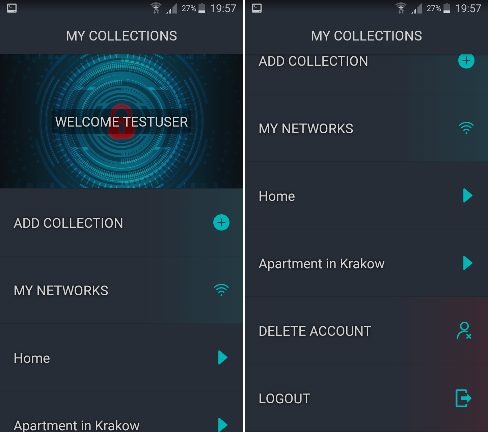
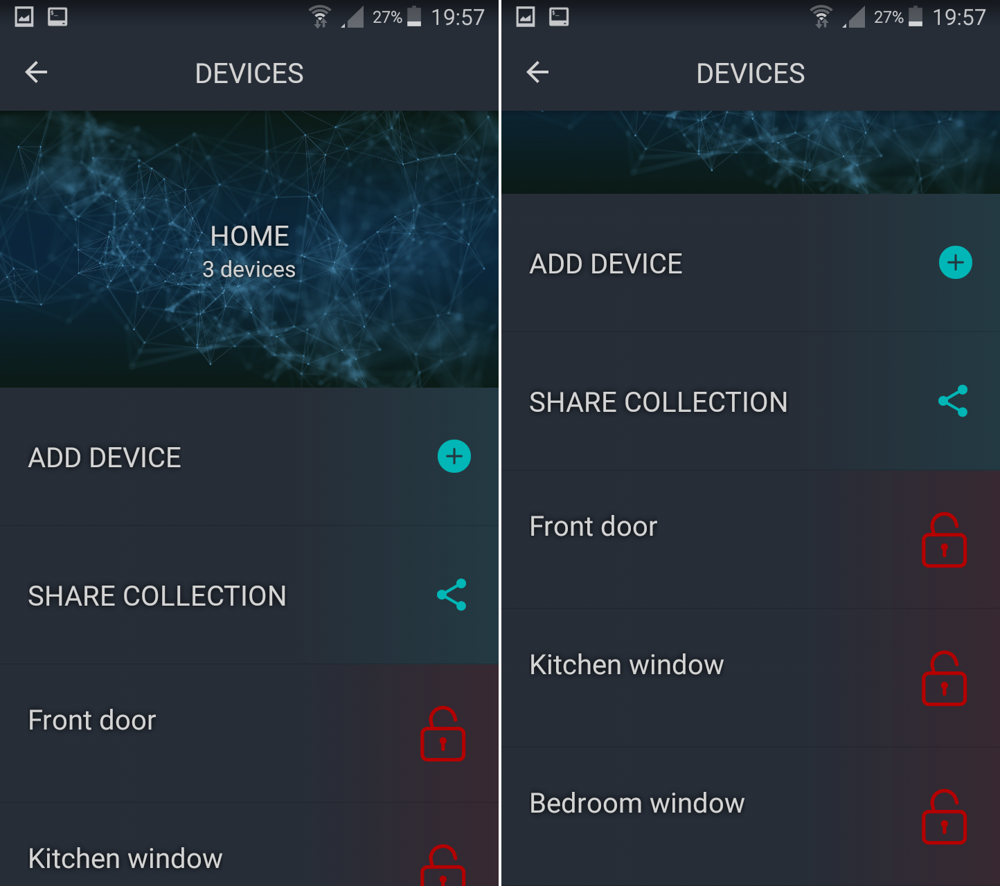
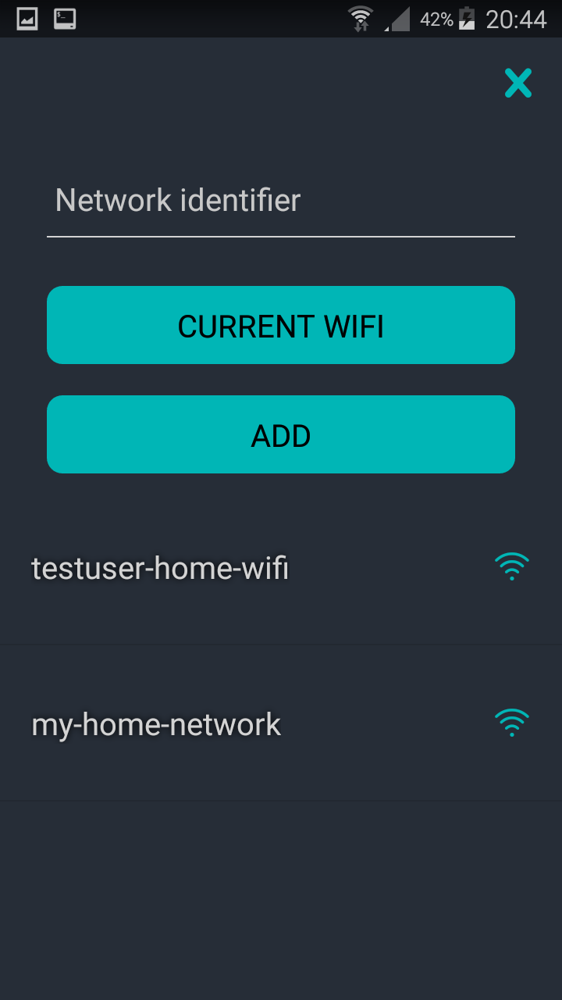

# Doorime

A mobile application that is a presentation layer of a system that allows monitoring windows and doors at home. The project has been created to the needs of the University "Internet of Things" course. The application was implemented using React Native framework, with the use of the Expo platform.

## Features
- creating collections
- connecting with physical sensors and adding them to collections
- viewing the state of sensors (open/closed)
- detection of the moment when the user leaves the house (when disconnected from the home network)
- sending the notification about opened sensors when the user leaves the house
- sharing collections between users

## Screenshots
### Login screen

### Home screen

### Collection screen

### User networks

